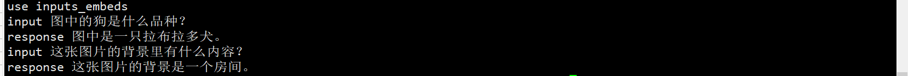

##  statement
- [deep_training](https://github.com/ssbuild/deep_training)

```text
    2023-10-18 微调推理测试初步完成
    2023-10-17 initial visualglm_finetuning
```
   


## install
  - pip install -U -r requirements.txt
  - 如果无法安装 , 可以切换官方源 pip install -i https://pypi.org/simple -U -r requirements.txt  


## weight

- [visualglm-6b](https://huggingface.co/THUDM/visualglm-6b) 

    


## data sample
   open_data https://github.com/ssbuild/open_data
    
单条数据示例
```text
p prefix  optional
q question optional
a answer   must

```
```json
{"id": 1, "paragraph": [{"q": "../assets/demo.jpeg</img>\n图中的狗是什么品种？", "a": "图中是一只拉布拉多犬。"}]}
```
或者 

```json
{
    "id": 0,
    "conversations": [
      {
        "from": "user",
        "value": "../assets/demo.jpeg</img>\n图中的狗是什么品种？"
      },
      {
        "from": "assistant",
        "value": "图中是一只拉布拉多犬。"
      }
    ]
}
```


## infer
    # infer.py 推理预训练模型
    # infer_finetuning.py 推理微调模型
    # infer_lora_finetuning.py 推理lora微调模型
     python infer.py


| **量化等级**    | **最低 GPU 显存** |
| -------------- | ----------------- |
| FP16（无量化）   | 13 GB             |
| INT8           | 10 GB              |
| INT4           | 6 GB               |

   




## training
```text
    # 制作数据
    cd scripts
    bash train_full.sh -m dataset 
    or
    bash train_lora.sh -m dataset 
    or
    bash train_ptv2.sh -m dataset 
    
    注: num_process_worker 为多进程制作数据 ， 如果数据量较大 ， 适当调大至cpu数量
    dataHelper.make_dataset_with_args(data_args.train_file,mixed_data=False, shuffle=True,mode='train',num_process_worker=0)
    
    # 全参数训练 
        bash train_full.sh -m train
        
    # lora adalora ia3 
        bash train_lora.sh -m train
        
    # ptv2
        bash train_ptv2.sh -m train
```

## 训练参数
[训练参数](args.MD)


## 友情链接

- [pytorch-task-example](https://github.com/ssbuild/pytorch-task-example)
- [chatmoss_finetuning](https://github.com/ssbuild/chatmoss_finetuning)
- [chatglm_finetuning](https://github.com/ssbuild/chatglm_finetuning)
- [chatglm2_finetuning](https://github.com/ssbuild/chatglm2_finetuning)
- [t5_finetuning](https://github.com/ssbuild/t5_finetuning)
- [llm_finetuning](https://github.com/ssbuild/llm_finetuning)
- [llm_rlhf](https://github.com/ssbuild/llm_rlhf)
- [chatglm_rlhf](https://github.com/ssbuild/chatglm_rlhf)
- [t5_rlhf](https://github.com/ssbuild/t5_rlhf)
- [rwkv_finetuning](https://github.com/ssbuild/rwkv_finetuning)
- [baichuan_finetuning](https://github.com/ssbuild/baichuan_finetuning)
- [baichuan2_finetuning](https://github.com/ssbuild/baichuan_finetuning)
- [xverse_finetuning](https://github.com/ssbuild/xverse_finetuning)
- [aigc_serving](https://github.com/ssbuild/aigc_serving)
- [aigc_evals](https://github.com/ssbuild/aigc_evals)

## 
    纯粹而干净的代码


## 关于续写
    训练 q 置空
    推理如下
    model = pl_model.get_glm_model()
    model.generate_for_continue_writing(tokenizer, "请帮我续写一段关于春天文字的文字", max_length=2048,
                                            eos_token_id=config.eos_token_id,
                                            do_sample=True, top_p=0.7, temperature=0.95,)
    

## Reference
    https://github.com/THUDM/ChatGLM-6B


## Star History

[](https://star-history.com/#ssbuild/chatglm_finetuning&Date)

